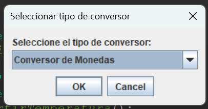
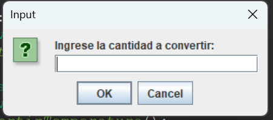
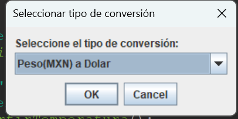
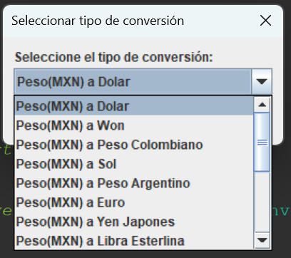
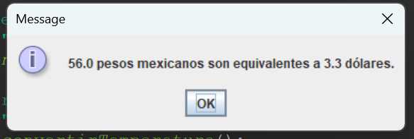
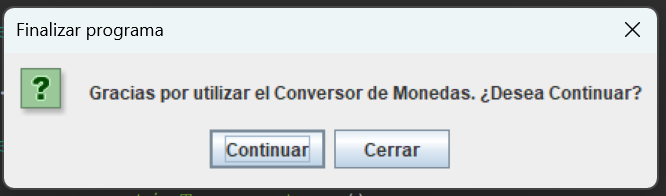
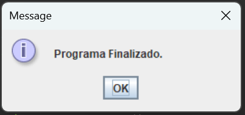

# Conversor-de-monedas-Erik-David-Medina-Lopez

Este es un proyecto de una aplicación de conversión de unidades desarrollado en Java, inicialmente se desarrollo como reto del programa ONE Next Education donde se realizaria un conversor de divisas y al conversor se le añadirian mas tipos de conversion como un extra por lo que de momento esta aplicacion tiene conversion de divisas, conversion de longitud, conversion de peso, conversion de grados.

## Tecnologías utilizadas

- Java
- Swing (para la interfaz gráfica)
- JOptionPane (para mostrar mensajes y obtener información del usuario)

## Instrucciones de uso

1. Clona o descarga este repositorio.

2. Abre el proyecto en tu entorno de desarrollo Java preferido.

3. Navega hasta la clase `ConversorMonedasApp`.

4. Ejecuta la clase `ConversorMonedasApp` para iniciar la aplicación.

5. Selecciona el tipo de conversor que deseas utilizar: Monedas, Longitudes, Peso o Grados.

6. Sigue las indicaciones en pantalla para ingresar los valores y realizar las conversiones correspondientes.

7. Para añadir nuevas funcionalidades o modificar el código, puedes explorar las diferentes clases del proyecto y realizar los cambios necesarios.

## Capturas de pantalla / Videos

## Contribuciones

Siéntete libre de contribuir a este proyecto enviando pull requests con mejoras o correcciones de errores.

## Licencia

Este proyecto está bajo la Licencia MIT. Puedes consultar el archivo [LICENSE](ruta/LICENSE) para obtener más detalles.

